# Polar Bookshop

A personal, repository-per-component implementation inspired by the Polar Bookshop system in [Cloud Native Spring in Action][book].

This organization contains independently versioned services, shared runtime configuration, and environment deployment definitions.\
It is a hands-on learning project, not an official implementation or a direct fork of the book source code.

> [!NOTE]
> For the chapter-by-chapter learning workspace, see [fResult/cloud-native-spring-in-action][learning-repo].

## System repositories

The responsibilities below describe the intended role of each component in the Polar Bookshop architecture.\
They are a guide derived from the book's final project—not a promise to reproduce its code, design, dependencies, or release versions exactly.

| Repository           | Responsibility                                                                               |   Status   |
|----------------------|----------------------------------------------------------------------------------------------|:----------:|
| [catalog-service]    | REST API for managing the book catalog, with PostgreSQL persistence.                         | Available  |
| [config-service]     | Configuration server that serves application configuration from Git.                         | Available  |
| [config-repo]        | Version-controlled, externalized application configuration consumed by Config Service.       | Available  |
| [polar-deployment]   | Environment setup and deployment configuration, including local and Kubernetes resources.    | Available  |
| `order-service`      | Reactive API for placing book orders, storing them in PostgreSQL, and tracking their status. |  Planned   |
| `edge-service`       | API gateway for routing requests, authentication, rate limiting, and circuit breakers.       |  Planned   |
| `dispatcher-service` | Processes accepted-order events and publishes dispatch notifications through RabbitMQ.       |  Planned   |
| `polar-ui`           | Frontend for browsing and managing books, and placing and viewing orders.                    |  Planned   |
| `quote-service`      | Reactive REST API for retrieving book quotes, including random quotes by genre.              |  Planned   |
| `quote-function`     | Function-based service for retrieving book quotes.                                           |  Planned   |

## Target architecture

The diagram shows the target topology for this organization.\
It is informed by the final Polar Bookshop project from the book and the repositories published by the [PolarBookshop reference organization][polarbookshop-reference].\
It includes both available and planned repositories; it does not imply that every component is already deployed or that this implementation will mirror the reference code, design, dependencies, or release versions exactly.

`polar-deployment` provides the runtime environment around the services—for example, Docker Compose, Kubernetes resources, backing services, and delivery configuration.\
Each application repository owns its source code, tests, container build, and CI workflow.

```mermaid
%%{init: {'theme':'base','securityLevel':'loose','themeVariables':{'darkMode':true,'background':'#333333','primaryColor':'#FFFFFF','primaryTextColor':'#0F172A','primaryBorderColor':'#CBD5E1','secondaryColor':'#F8FAFC','secondaryTextColor':'#0F172A','tertiaryColor':'#F8FAFC','tertiaryTextColor':'#0F172A','lineColor':'#CBD5E1','textColor':'#F8FAFC','edgeLabelBackground':'#F8FAFC','nodeTextColor':'#0F172A','fontSize':'16px'},'themeCSS':'svg { background-color: #333333 !important; } .edgeLabel, .edgeLabel p { background-color: #F8FAFC !important; color: #0F172A !important; }'}}%%
flowchart TB
    browser[Browser] --> edge[edge-service]
    edge --> ui[polar-ui]
    edge --> catalog[catalog-service]
    edge --> order[order-service]

    order -->|checks catalog| catalog
    catalog -->|polardb_catalog| postgres[(PostgreSQL)]
    order -->|polardb_order| postgres
    order -->|publishes order-accepted| rabbit[RabbitMQ]
    rabbit -->|consumes order-accepted| dispatcher[dispatcher-service]
    dispatcher -->|publishes order-dispatched| rabbit
    rabbit -->|consumes order-dispatched| order

    edge --> redis[(Redis)]
    edge --> keycloak[Keycloak]
    catalog --> keycloak
    order --> keycloak

    configRepo[config-repo] -->|Git backend; catalog config only| config[config-service]

    catalog --> telemetry[Observability stack]
    order --> telemetry
    dispatcher --> telemetry
    edge --> telemetry
    config --> telemetry
    ui -->|container logs| telemetry

    %% Chapter 16 serverless examples are deployed independently with their KService manifests.
    quote[quote-service] -. "knative/kservice.yml" .-> knative[Knative Serving platform]
    quoteFunction[quote-function] -. "knative/kservice.yml" .-> knative

    deployment[polar-deployment] -. provisions and deploys .-> edge
    deployment -. provisions and deploys .-> catalog
    deployment -. provisions and deploys .-> order
    deployment -. provisions and deploys .-> dispatcher
    deployment -. provisions and deploys .-> ui
    deployment -. provisions and deploys .-> config
    deployment -. provisions .-> postgres
    deployment -. provisions .-> rabbit
    deployment -. provisions .-> redis
    deployment -. provisions .-> keycloak
    deployment -. provisions .-> telemetry

    %% Fixed #333333 canvas: the diagram looks the same in light and dark mode.
    %% Every node uses dark text on a light background (WCAG AA or better).
    classDef client fill:#E0F2FE,stroke:#0369A1,color:#0C4A6E,stroke-width:2px;
    classDef gateway fill:#EDE9FE,stroke:#6D28D9,color:#2E1065,stroke-width:2px;
    classDef service fill:#DBEAFE,stroke:#1D4ED8,color:#172554,stroke-width:2px;
    classDef serverless fill:#F3E8FF,stroke:#7E22CE,color:#3B0764,stroke-width:2px;
    classDef data fill:#DCFCE7,stroke:#15803D,color:#14532D,stroke-width:2px;
    classDef messaging fill:#FFEDD5,stroke:#C2410C,color:#7C2D12,stroke-width:2px;
    classDef identity fill:#FCE7F3,stroke:#BE185D,color:#831843,stroke-width:2px;
    classDef configuration fill:#FEF3C7,stroke:#B45309,color:#78350F,stroke-width:2px;
    classDef observability fill:#CFFAFE,stroke:#0E7490,color:#164E63,stroke-width:2px;
    classDef platform fill:#E2E8F0,stroke:#475569,color:#0F172A,stroke-width:2px;
    classDef deployment fill:#F1F5F9,stroke:#475569,color:#0F172A,stroke-width:2px;
    classDef planned stroke-dasharray:5 5;

    class browser client;
    class edge gateway;
    class ui,catalog,order,dispatcher service;
    class quote,quoteFunction serverless;
    class postgres,redis data;
    class rabbit messaging;
    class keycloak identity;
    class configRepo,config configuration;
    class telemetry observability;
    class knative platform;
    class deployment deployment;
    class order,dispatcher,edge,ui,quote,quoteFunction planned;

    click deployment href "https://github.com/fResult-PolarBookshop/polar-deployment" "Open polar-deployment on GitHub" _blank
    click catalog href "https://github.com/fResult-PolarBookshop/catalog-service" "Open catalog-service on GitHub" _blank
    click config href "https://github.com/fResult-PolarBookshop/config-service" "Open config-service on GitHub" _blank
    click configRepo href "https://github.com/fResult-PolarBookshop/config-repo" "Open config-repo on GitHub" _blank

    %% Blue HTTP, purple service call, green data, orange events, pink identity,
    %% amber configuration, teal telemetry, and gray provisioning.
    %% Bright strokes have at least 3:1 contrast against the fixed #333333 canvas.
    linkStyle 0,1,2,3 stroke:#60A5FA,color:#1E3A8A,stroke-width:2.5px;
    linkStyle 4 stroke:#C4B5FD,color:#4C1D95,stroke-width:2.5px;
    linkStyle 5,6,11 stroke:#4ADE80,color:#14532D,stroke-width:2.5px;
    linkStyle 7,8,9,10 stroke:#FDBA74,color:#7C2D12,stroke-width:2.5px;
    linkStyle 12,13,14 stroke:#F9A8D4,color:#831843,stroke-width:2.5px;
    linkStyle 15 stroke:#FCD34D,color:#78350F,stroke-width:2.5px;
    linkStyle 16,17,18,19,20,21 stroke:#5EEAD4,color:#164E63,stroke-width:2.5px;
    linkStyle 22,23 stroke:#C4B5FD,color:#3B0764,stroke-width:2.5px;
    linkStyle 24,25,26,27,28,29,30,31,32,33,34 stroke:#CBD5E1,color:#0F172A,stroke-width:2px;

```

## Implementation approach

The book provides the architectural direction, tooling, and learning path.\
Each repository is created from scratch and can deliberately differ from the book when newer, more suitable, or more maintainable choices are available.

Examples of intentional differences may include:

- Current Java, Spring Boot, dependency, container, and GitHub Actions versions rather than the versions published with the book.
- Immutable data structures and functional patterns, with [Vavr][vavr] as a primary library where appropriate.
- Alternative designs and implementation details while preserving the component's learning objective.

Repository documentation is the source of truth for the implementation, prerequisites, supported commands, APIs, and deployment instructions of that component.

## Related projects

- [Official book source code][official-source]
- [Polar Bookshop UI reference][polar-ui-reference]
- [My chapter-by-chapter learning repository][learning-repo]

[book]: https://www.manning.com/books/cloud-native-spring-in-action
[official-source]: https://github.com/ThomasVitale/cloud-native-spring-in-action
[learning-repo]: https://github.com/fResult/cloud-native-spring-in-action
[polar-ui-reference]: https://github.com/PolarBookshop/polar-ui/tree/v1
[polarbookshop-reference]: https://github.com/PolarBookshop
[catalog-service]: https://github.com/fResult-PolarBookshop/catalog-service
[config-service]: https://github.com/fResult-PolarBookshop/config-service
[config-repo]: https://github.com/fResult-PolarBookshop/config-repo
[polar-deployment]: https://github.com/fResult-PolarBookshop/polar-deployment
[vavr]: https://vavr.io/

<footer>
  

      .  .  .  .  .  .  .  .  .  .  .  .  .  .  
  

  

    [This Space Intentionally Left Blank]
  

  

    The bottom of every page is padded so readers can maintain a consistent eyeline.
  

</footer>
